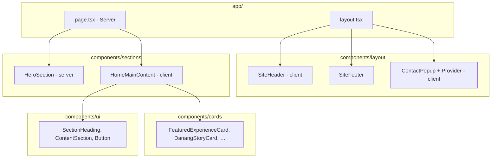

# Kiến trúc Frontend — Danaman

Tài liệu mô tả kiến trúc hiện tại, quy ước phát triển và **requirement** chức năng của lớp frontend trong monorepo `danaman/`.

---

## 1. Tổng quan

Danaman là website giới thiệu trải nghiệm và câu chuyện Đà Nẵng, xây trên **Next.js App Router** với ưu tiên **Server Components**, chỉ dùng Client Components khi cần tương tác trình duyệt.

| Hạng mục | Công nghệ |
|----------|-----------|
| Framework | Next.js 16 (App Router, Turbopack dev) |
| UI | React 19 |
| Ngôn ngữ | TypeScript 5 |
| Styling | Tailwind CSS v4 (`@import "tailwindcss"`) |
| Font | `next/font/google`: Montserrat, Playfair Display, Allura, Inter |
| Ảnh | `next/image` |
| Dữ liệu tạm | XML mock (`data/stories-mock.xml`) + Route Handlers `/api/*` |
| Form liên hệ | Web3Forms (client-side submit) |

Ngôn ngữ giao diện mặc định: **Tiếng Việt** (`<html lang="vi">`).

---

## 2. Cấu trúc thư mục

```
danaman/
├── app/                          # App Router
│   ├── layout.tsx                # Root layout: font, header, footer, ContactPopupProvider
│   ├── page.tsx                  # Trang chủ (Server Component)
│   ├── globals.css               # Design tokens, Tailwind theme
│   ├── (routes)/                 # Route group (không ảnh hưởng URL)
│   │   ├── layout.tsx            # Padding-top cho fixed header
│   │   └── stories/[id]/         # Chi tiết câu chuyện + loading/error
│   └── api/                      # Route Handlers (BFF)
│       ├── stories/
│       ├── experiences/
│       ├── opportunities/
│       └── health/
├── components/
│   ├── layout/                   # Shell: header, footer, contact popup
│   ├── sections/                 # Khối nội dung trang (hero, home sections, …)
│   ├── cards/                    # Card tái sử dụng
│   ├── story-detail/             # UI trang chi tiết story
│   └── ui/                       # Primitives (Button, SectionHeading, …)
├── lib/                          # Logic chia sẻ (không phụ thuộc UI)
│   ├── api/                      # Client fetch helpers
│   ├── hooks/                    # React hooks (client)
│   ├── server/                   # Helpers phía server (api-response)
│   └── *.ts                      # Nav, layout, mappers, XML loader, …
├── types/                        # Domain types dùng chung
├── public/                       # Static assets
└── docs/                         # Tài liệu dự án
```

**Quy ước import:** dùng alias `@/*` → root `danaman/`.

---

## 3. Kiến trúc App Router

### 3.1 Root layout

`app/layout.tsx` bọc toàn site:

- Load font qua CSS variables (`--font-montserrat`, `--font-inter`, …).
- `ContactPopupProvider` (client) — popup liên hệ global, mount một lần.
- `SiteHeader` (client) — fixed, trong suốt trên hero, solid khi scroll hoặc trang con.
- `<main>` — nội dung route.
- `SiteFooter` (server) — testimonial + footer links.

### 3.2 Trang chủ (`app/page.tsx`)

Server Component:

1. Đọc fallback stories từ XML (`loadActiveStoryRecords()`).
2. Render `HeroSection` (server).
3. Render `HomeMainContent` (client) — fetch `/api/stories`, fallback XML nếu lỗi.
4. Render `PhuOngFoodsBanner` (server).

### 3.3 Route group `(routes)`

- `layout.tsx` thêm `pt-[84px]` để nội dung không bị header che.
- Story detail: `stories/[id]/page.tsx` (server fetch API nội bộ), kèm `loading.tsx` và `error.tsx`.

### 3.4 Metadata

- Root: `export const metadata` trong `layout.tsx`.
- Trang con: bổ sung `generateMetadata` khi cần SEO theo từng story (chưa implement).

---

## 4. Phân lớp component



| Lớp | Trách nhiệm | `"use client"` |
|-----|-------------|----------------|
| `layout/` | Shell site, navigation, popup global | Header, ContactPopup*, FooterLinkGroup |
| `sections/` | Khối section theo trang | Chỉ khi fetch/state (HomeMainContent, testimonials carousel, …) |
| `cards/` | Presentational cards | Không (trừ card có interaction riêng) |
| `story-detail/` | Trang chi tiết | Gallery, ActionButtons |
| `ui/` | Building blocks nhỏ | Tránh trừ khi cần |

**Nguyên tắc:** đẩy `"use client"` xuống lá càng sâu càng tốt; page/layout ưu tiên Server Component.

---

## 5. Data fetching

### 5.1 Luồng dữ liệu stories

```
data/stories-mock.xml
        │
        ▼
lib/stories-xml.ts  ──►  app/api/stories/route.ts  (GET)
        │                         │
        │                         ▼
        │              lib/api/stories-client.ts  (fetch /api/stories)
        │                         │
        ▼                         ▼
 Server fallback            HomeMainContent (client)
 (page.tsx)                 useStories hook (nếu dùng)
```

- **Nguồn chính hiện tại:** XML mock qua API Route Handler.
- **Client fetch:** `cache: "no-store"` — luôn lấy dữ liệu mới khi load trang.
- **Fallback:** nếu API lỗi hoặc rỗng, UI dùng records từ server (`fallbackStoryRecords`).
- **Story detail:** server gọi `/api/stories/[id]` với base URL suy ra từ request headers / env.

### 5.2 API response shape

```ts
type ApiResponse<T> = {
  data: T;
  message: string;
};
```

Route handlers dùng `ok()` / `fail()` từ `lib/server/api-response.ts`.

### 5.3 Experiences & Opportunities

- API routes tồn tại (`/api/experiences`, `/api/opportunities`).
- Client hiện map stories → experience cards qua `lib/story-card-mappers.ts` và `lib/story-experience-ui.ts` (giá, rating, duration là UI mock derived).

---

## 6. State & tương tác global

### Contact popup

| Thành phần | Vai trò |
|------------|---------|
| `ContactPopupProvider` | Context: `openContactPopup`, `closeContactPopup` |
| `ContactPopup` | Modal portal (`createPortal` → `document.body`) |
| Trigger | Header nav, footer link (`opensContactPopup: true`) |

Không dùng global state library (Redux/Zustand). Chỉ React Context cho popup.

### Header scroll

`SiteHeader` theo dõi `window.scrollY` và `pathname` để đổi nền fixed header.

---

## 7. Design system

### 7.1 Màu (CSS variables — `globals.css`)

| Token | Hex | Dùng cho |
|-------|-----|----------|
| `--danaman-bg` | `#1F2717` | Nền tối chính |
| `--danaman-gold` | `#D0AE7D` | Accent, border, CTA |
| `--danaman-light` | `#EEDBC0` | Text sáng trên nền tối |
| `--danaman-green` | `#25301C` | Nền input/form |
| `--danaman-subtext` | `#D7C9B2` | Text phụ |
| `--danaman-script` | `#AAB38A` | Script / decorative |

Nền section sáng trang chủ: `#F7F4EE`.

### 7.2 Typography

| Font variable | Vai trò |
|---------------|---------|
| `--font-montserrat` | Nav, label, button uppercase |
| `--font-playfair` | Heading hero |
| `--font-allura` | Script decorative |
| `--font-inter` | Body, form, mô tả |

Áp dụng qua class arbitrary, ví dụ `font-[family-name:var(--font-inter)]` hoặc `font-[family-name:var(--font-montserrat)]`.

### 7.3 Layout

- Container: `siteContentContainerClass` — `max-w-[1440px]`, padding responsive (`lib/site-layout.ts`).
- Anchor scroll: `section[id] { scroll-margin-top: 6rem }` — bù fixed header.
- Responsive: **mobile-first** (Tailwind breakpoints `sm`, `md`, `lg`, `xl`).

### 7.4 Component UI

Chưa tích hợp Shadcn/ui; primitives tự viết trong `components/ui/`. Rule dự án khuyến nghị Shadcn khi mở rộng form/input phức tạp.

---

## 8. Routing & navigation

### 8.1 In-page anchors (trang chủ)

| Anchor | Section |
|--------|---------|
| `#experiences` | Trải nghiệm nổi bật |
| `#stories` | Câu chuyện Đà Nẵng |
| `#ve-danaman` | Footer — Về Danaman |
| `#lien-he` | Footer — Liên hệ |

Định nghĩa tại `lib/site-nav.ts`, `lib/footer-nav.ts`.

### 8.2 Dynamic routes

| URL | Mô tả |
|-----|-------|
| `/` | Trang chủ |
| `/stories/[id]` | Chi tiết câu chuyện / trải nghiệm |

### 8.3 External links

Facebook, Zalo, Phú Ông Foods — `lib/footer-social-links.ts`, mở tab mới (`target="_blank"`, `rel="noopener noreferrer"`).

---

## 9. Requirement — Popup Liên hệ

Popup mở từ nút **Liên hệ** (header/footer). Gửi form qua **Web3Forms trực tiếp từ trình duyệt** (không qua API route server — Web3Forms chặn server-side Cloudflare).

### 9.1 Kênh liên hệ trong popup

1. **Facebook Messenger** — link external.
2. **Zalo** — link external.
3. **Form “Để lại thông tin”** — submit Web3Forms.

### 9.2 Trường form & validation

| Trường | Requirement |
|--------|-------------|
| Họ và tên | Bắt buộc, trim, **tối đa 50 ký tự** (`maxLength=50`) |
| Số điện thoại | Bắt buộc, **đúng 10 chữ số** (chỉ digit), hiển thị format **`XXXX XXX XXX`** (vd: `0905 324 235`) |
| Nội dung | Bắt buộc, trim, **tối đa 300 ký tự** (`maxLength=300`) |

**Quy tắc số điện thoại:**

- Input: `type="tel"`, `inputMode="numeric"`, `maxLength={12}` (10 số + 2 khoảng trắng).
- Chỉ chấp nhận digit; format realtime khi gõ.
- Submit gửi số đã format (vd: `0905 324 235`).

**Thông báo lỗi (tiếng Việt):**

- Thiếu field: *"Vui lòng điền đầy đủ họ tên, số điện thoại (10 chữ số) và nội dung."*
- Vượt max length: *"Họ tên tối đa 50 ký tự, nội dung tối đa 300 ký tự."*
- Thiếu env key: *"Form liên hệ chưa được cấu hình…"*
- Lỗi mạng/API: *"Không gửi được thông tin. Vui lòng thử lại sau."*

**Thông báo thành công:**

- *"Đã gửi thông tin. Danaman sẽ phản hồi bạn sớm."*
- Reset form sau success.

### 9.3 Web3Forms payload

```json
{
  "access_key": "<NEXT_PUBLIC_WEB3FORMS_ACCESS_KEY>",
  "subject": "[Danaman] Liên hệ mới từ {name}",
  "from_name": "Danaman",
  "name": "{trimmedName}",
  "phone": "{formattedPhone}",
  "message": "{trimmedMessage}"
}
```

Endpoint: `POST https://api.web3forms.com/submit`

### 9.4 UX popup

- Đóng: nút ×, click overlay, phím `Escape`.
- Khi mở: `document.body.style.overflow = "hidden"`.
- Render qua portal — `z-index` cao (`z-[999]`).
- Trạng thái submit: disable inputs, label button *"Đang gửi…"*.
- Feedback hiển thị inline (`role="status"`, `aria-live="polite"`).

### 9.5 Cấu hình môi trường

```env
# .env.local
NEXT_PUBLIC_WEB3FORMS_ACCESS_KEY=<access-key từ web3forms.com>
```

- Key gắn với email nhận form trên Web3Forms.
- Biến `NEXT_PUBLIC_*` — intentional public (Web3Forms khuyến nghị client-side).
- Production: set cùng biến trên hosting (Vercel, …).

---

## 10. Environment variables (frontend)

| Biến | Bắt buộc | Mô tả |
|------|----------|-------|
| `NEXT_PUBLIC_WEB3FORMS_ACCESS_KEY` | Có (form liên hệ) | Access key Web3Forms |
| `NEXT_PUBLIC_SITE_URL` | Khuyến nghị (prod) | Base URL cho server fetch nội bộ story detail |

Tham chiếu mẫu: `.env.example`.

---

## 11. Quy ước phát triển

### 11.1 Server vs Client

- Mặc định **Server Component** — không thêm `"use client"` trừ khi cần: state, effect, browser API, event handlers.
- Server Actions: dùng cho mutation khi phù hợp (form liên hệ hiện dùng client fetch vì Web3Forms).
- Colocate `loading.tsx`, `error.tsx`, `not-found.tsx` với route.

### 11.2 Styling

- Tailwind utility-first, mobile-first.
- Thứ tự class gợi ý: layout → spacing → sizing → typography → color → effects.
- Tránh inline style trừ gradient/background phức tạp (hero).
- Màu brand: ưu tiên CSS variables hoặc hex đã chuẩn hóa trong design system.

### 11.3 Validation (hướng tới)

Rule dự án khuyến nghị **Zod** + react-hook-form cho form phức tạp. Popup liên hệ hiện validate thủ công — nên migrate sang Zod schema khi refactor:

```ts
// Gợi ý schema tương lai
const contactFormSchema = z.object({
  name: z.string().trim().min(1).max(50),
  phone: z.string().refine((v) => getPhoneDigits(v).length === 10),
  message: z.string().trim().min(1).max(300),
});
```

### 11.4 Types

- Domain types tập trung tại `types/index.ts` (`Story`, `Experience`, `Opportunity`, `ApiResponse`).
- Mapper XML/API → UI: `lib/story-card-mappers.ts`, `lib/story-experience-ui.ts`.

### 11.5 Images

- Local: `/public/**`
- Remote: cấu hình `remotePatterns` trong `next.config.ts` (hiện: `images.unsplash.com`).
- Logo header: `unoptimized` (PNG chất lượng cao).

---

## 12. Accessibility & SEO (hiện trạng)

| Hạng mục | Trạng thái |
|----------|------------|
| `lang="vi"` | ✅ |
| Nav `aria-label` | ✅ Header |
| Popup close `aria-label` | ✅ |
| Form feedback `aria-live` | ✅ |
| Icon decorative `aria-hidden` | ✅ Popup benefits |
| `generateMetadata` per story | ⬜ Chưa |
| Mobile nav menu đầy đủ | ⬜ Chỉ CTA + Liên hệ trên mobile |

---

## 13. Known gaps & đề xuất

1. **Validation form:** chưa dùng Zod/react-hook-form như rule dự án — nên chuẩn hóa khi thêm form mới.
2. **Duplicate fetch logic:** `HomeMainContent` và `useStories` trùng pattern — có thể gom hook.
3. **FeaturedStoriesClientSection:** component song song với `HomeMainContent`, một phần chưa dùng trên homepage hiện tại — cân nhắc gộp hoặc xóa dead code.
4. **i18n:** UI hard-code tiếng Việt; chưa có hệ i18n nếu mở rộng đa ngôn ngữ.
5. **Database:** stories vẫn từ XML mock; API POST story trả 501 — frontend cần cập nhật khi có CMS/DB thật.
6. **Contact API server-side:** không dùng được với Web3Forms free tier — giữ client submit.
7. **Metadata trang story:** bổ sung `generateMetadata` cho OG/Twitter khi SEO quan trọng.

---

## 14. Scripts liên quan frontend

```bash
npm run dev      # Dev server (Turbopack)
npm run build    # Production build + typecheck
npm run lint     # ESLint (eslint-config-next)
```

---

## 15. Liên kết mã nguồn chính

| Chức năng | File |
|-----------|------|
| Root layout | `app/layout.tsx` |
| Trang chủ | `app/page.tsx` |
| Story detail | `app/(routes)/stories/[id]/page.tsx` |
| Contact popup | `components/layout/contact-popup.tsx` |
| Popup provider | `components/layout/contact-popup-provider.tsx` |
| Header | `components/layout/site-header.tsx` |
| Home sections | `components/sections/home-main-content.tsx` |
| Design tokens | `app/globals.css` |
| Types | `types/index.ts` |
| Stories API client | `lib/api/stories-client.ts` |

---

*Tài liệu phản ánh codebase tại thời điểm review. Cập nhật khi thay đổi kiến trúc routing, data layer hoặc requirement form liên hệ.*
